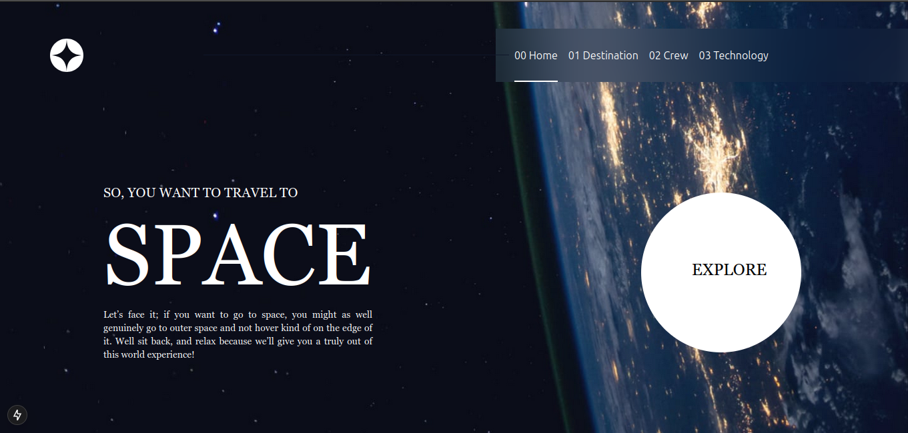

🚀 Frontend Mentor Challenge - Space Tourism Website
This is a solution to a Frontend Mentor challenge, built using Next.js, Tailwind CSS, and TypeScript. The project aims to provide a fully responsive and interactive experience for users exploring space tourism.

🛠 Tech Stack
This project was built using:

Next.js – React framework for server-side rendering (SSR) and static site generation (SSG).
Tailwind CSS – Utility-first CSS framework for fast UI development.
TypeScript – Enhances JavaScript with static typing.

📷 Preview

 

📦 Features
✅ Fully responsive design (Mobile and Desktop).
✅ Dynamic content switching (e.g., technology tabs, crew selection).
✅ Optimized image handling with Next.js <Image> component.